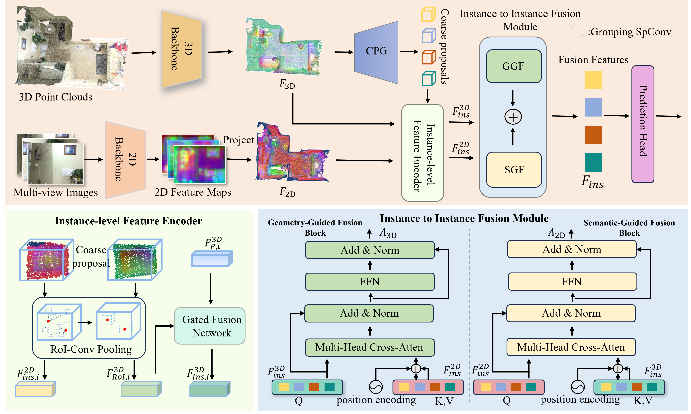

# IIFNet3D: Instance-to-Instance Fusion with Dual Attention for Indoor RGB-D 3D Object Detection
This repo contains PyTorch implementation for IIFNet3D based on [MMDetection3D](https://github.com/open-mmlab/mmdetection3d).

## Method
Overall pipeline of IIFNet3D:

## Getting Started
For environment setup:
- [Installation](docs/installation.md) 

For dataset preparation:
- [Dataset preparation](data/README.md)

For training and evaluation:
- [Train and Eval](docs/run.md)

## Results
Visualization results on ScanNet:

Visualization results on SUN-RGBD:

